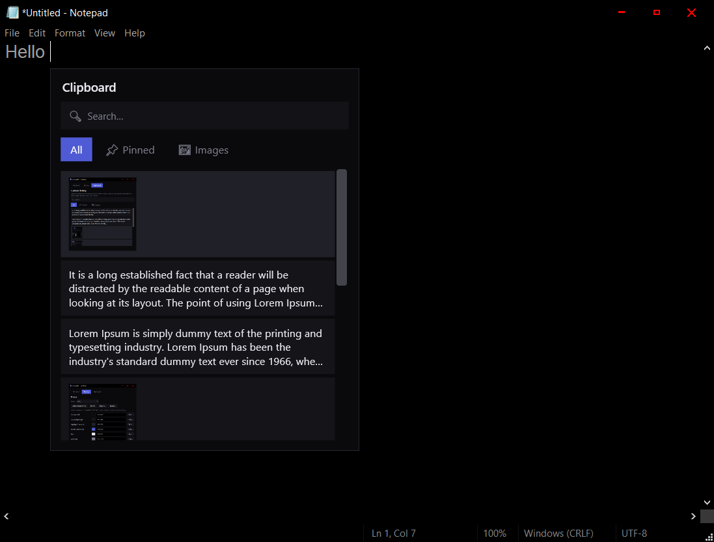
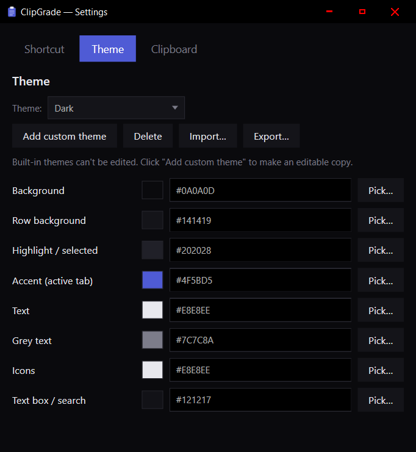
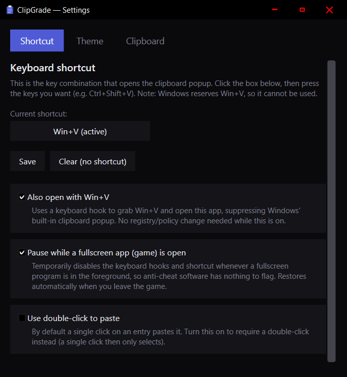
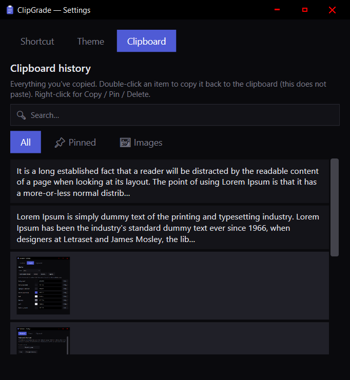

# ClipGrade

A lightweight Windows clipboard manager built with **C# + WPF (.NET 9)** — an
upgrade to the built-in clipboard.
It runs quietly in the system tray and pops up a searchable clipboard history
right above your text cursor.

## Screenshots

| Popup over a text field | Theme settings |
|:---:|:---:|
|  |  |
| **Shortcut settings** | **Clipboard history** |
|  |  |

## Features

- **Captures text and images** copied anywhere in Windows.
- **Keeps the last 30 clipboard entries** (images included). Pinned items are
  kept **forever** and never count against the 30-entry limit.
- **Right-click any entry** for a menu: Paste, Copy, Pin/Unpin, Delete. Pinned
  items show a small filled pin marker and persist across restarts.
- **Hover an entry** to preview its full text; **hover an image** for a larger
  preview.
- **Search box** + **tabs**: All · 📌 Pinned · 🖼 Images.
- **Global shortcut** opens the popup just above the I-beam in the focused text
  field (falls back to the mouse position if no caret is found).
- **Paste**: press `Enter` or double-click an entry. The popup never steals
  focus, so it pastes straight into the field you were typing in.
- `Esc` or clicking away closes the popup.
- **Settings window** (tray → *Settings…*) with Shortcut, Theme, and Clipboard
  tabs — see below.

## Running it

### From Visual Studio
1. Open `ClipboardApp.csproj` (File → Open → Project/Solution).
2. Press **F5** (or Ctrl+F5 to run without the debugger).

### From the command line
```powershell
dotnet run
```

The app has no main window — look for its icon in the system tray (bottom-right).
**Right-click** the tray icon for:
- **Show clipboard** – open the popup
- **Settings…** – open the settings window
- **Clipboard history…** – open settings on the Clipboard tab
- **Exit**

## Keyboard / mouse controls (popup)

| Action | Key |
|---|---|
| Open | Your shortcut (default `Ctrl+Shift+V`), or `Win+V` if enabled |
| Move selection | `↑` / `↓` |
| Paste selected | Click (single-click by default; `Enter` also works) |
| Per-entry options | Right-click (Paste / Copy / Pin / Delete) |
| Search | Just start typing |
| Edit / clear search | `Backspace`, or click the ✕ in the search box |
| Close | `Esc` or click outside |

## Settings

### Shortcut
- Click the shortcut box, press a key combination (e.g. `Ctrl+Shift+V`), then
  **Save**. If the combo can't be registered (already in use, or `Win+V` which
  Windows reserves), you get a warning and it resets to no shortcut.
- **Clear** removes the shortcut (you can still open from the tray).
- **Also open with Win+V** — uses a keyboard hook to grab `Win+V`, open this app,
  and suppress Windows' own clipboard popup. No registry/policy change needed.
- **Pause while a fullscreen app (game) is open** — temporarily disables the
  keyboard hooks and shortcut whenever a fullscreen program is in the
  foreground, then restores them when you leave it (see *Anti-cheat* below).
- **Use double-click to paste** — by default a single click pastes an entry;
  enable this to require a double-click (single click then only selects).

### Theme
Pick a theme from the dropdown: built-in **Dark** and **Light**, plus any custom
themes you create. Built-ins can't be edited — click **Add custom theme**, give
it a name, and you get an editable copy with color pickers for every part of the
UI (**Background, Row background, Highlight/selected, Accent, Text, Grey text,
Icons, Text box/search**). Click a swatch (or *Pick…*) for a color dialog, or
type a `#RRGGBB` value; changes apply instantly and are saved. **Delete** removes
a custom theme, and **Import…/Export…** load and save themes as `.json` files.

### Clipboard
The full history of everything you've copied, with a **search box** and **All /
📌 Pinned / 🖼 Images** tabs. **Double-click an item to copy it back to the
clipboard** (this does *not* paste and does *not* close the window).
**Right-click** an item for Copy / Pin / Delete.

## A note on Win+V

Windows normally reserves `Win+V` for its own Clipboard History, and a regular
hotkey registration can't take it. The **Also open with Win+V** option works
around this with a low-level keyboard hook that intercepts the combo before
Windows sees it (it taps `Ctrl` internally so releasing `Win` doesn't open the
Start menu). It only works while the app is running.

## A note on anti-cheat

This app uses the same techniques as mainstream clipboard managers (Ditto,
ClipboardFusion, etc.): global low-level keyboard/mouse hooks and a synthetic
`Ctrl+V` to paste. For everyday use this is fine. For competitive games with
**kernel-level anti-cheat** (Valorant/Vanguard, EasyAntiCheat, BattlEye, FACEIT),
enable **Pause while a fullscreen app is open**, or simply **Exit** the app from
the tray before playing — either removes the hooks entirely.

## Where data is stored

`%AppData%\ClipGrade\`
- `entries.json` — clipboard entry metadata (text + pin state)
- `settings.json` — your shortcut + theme + options
- `images\*.png` — captured images

Deleting that folder resets the app.

## Build a standalone .exe

```powershell
dotnet publish -c Release -r win-x64 --self-contained false -p:PublishSingleFile=true
```
The single-file `ClipGrade.exe` lands in
`bin\Release\net9.0-windows\win-x64\publish\`.

## Start automatically with Windows

Right-click the tray icon and toggle **Start on boot**. This adds/removes a
per-user entry under `HKCU\…\CurrentVersion\Run` pointing at the current
executable — no admin rights needed. (If you move or re-publish the .exe to a
new location, toggle it off and on again so the path updates.)

## Project layout

| File | Purpose |
|------|---------|
| `App.xaml(.cs)` | App entry point, theme resources, system-tray icon. |
| `MainWindow.xaml(.cs)` | The popup UI + clipboard/hotkey/hook handling. |
| `SettingsWindow.xaml(.cs)` | Shortcut / Theme / Clipboard settings window. |
| `Models/ClipboardEntry.cs` | One clipboard item (text or image). |
| `Models/Settings.cs` | Hotkey, theme, and option settings. |
| `Services/ClipboardStore.cs` | Shared entry list: capture, trim, persistence, clipboard I/O. |
| `Services/Storage.cs` | Reads/writes entries.json and image files. |
| `Services/SettingsStore.cs` | Reads/writes settings.json. |
| `Services/ThemeManager.cs` | Applies theme colors to app resources (live). |
| `Services/HookManager.cs` | Low-level keyboard/mouse hooks. |
| `Services/NativeMethods.cs` | Win32 P/Invoke declarations. |
| `Services/InputHelper.cs` | Caret-position lookup + paste simulation. |
